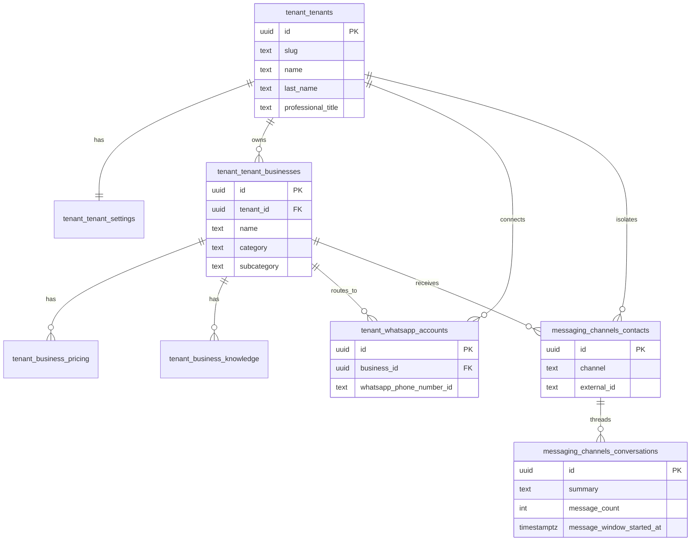

# Supabase Database — White Node / IndigoNode (v2)

PostgreSQL database hosted on Supabase for the WhatsApp automation platform. Data is organized by **schema** (namespace), not by putting everything in `public`.

**Current production schema:** `tenant` + `messaging_channels` (v2 — migrated 2026-08-24)

| Document | Purpose |
|----------|---------|
| [supabase_db_design.md](./resources/supabase_db_design.md) | Full design rationale, field decisions, n8n rollout checklist |
| [meta_business_setup.md](./guidance/meta_business_setup.md) | Meta / WhatsApp Business onboarding |
| [whatsapp_trigger_config.md](./guidance/whatsapp_trigger_config.md) | n8n WhatsApp trigger, webhook, send credentials |
| [supabase_postgres_node_config.md](./guidance/supabase_postgres_node_config.md) | n8n Postgres credential and database nodes |
| [migration_plan_v2.md](./resources/migration_plan_v2.md) | Step-by-step migration runbook (complete) |
| [`sql/`](../sql/) | Source of truth for DDL |

**Production workflow:** [`flows/IndigoNode_Whatsapp_bot_v1.4.json`](../flows/IndigoNode_Whatsapp_bot_v1.4.json) · **Flow docs:** [whatsapp_bot.md](./whatsapp_bot.md)

---

## Architecture overview

```text
WhatsApp webhook (n8n)
        │
        ▼
tenant.v_automation_config          ← lookup by whatsapp_phone_number_id
        │                             (tenant + business + pricing + knowledge)
        ▼
messaging_channels.get_conversation_summary   ← contact + conversation + summary + 24h count
        │
        ▼
AI Agent (n8n) — no LangChain memory; uses Postgres summary only
        │
        ▼
messaging_channels.update_conversation_summary   ← save rolling summary
```

### Core design rules

| Rule | Detail |
|------|--------|
| **Memory** | Rolling AI `summary` on `messaging_channels.conversations` only — **no message bodies stored** |
| **Multi-channel** | `messaging_channels` supports WhatsApp today; same tables for IG, SMS, email later |
| **Tenant lookup** | Webhook `metadata.phone_number_id` → `tenant.whatsapp_accounts` → `tenant.v_automation_config` |
| **Contact lookup** | Webhook `contacts[].wa_id` → `messaging_channels.contacts.external_id` where `channel = 'whatsapp'` |
| **Rate limit** | 30 inbound messages per conversation per **rolling 24h window** — enforced in n8n, **not** tied to `automation_plan` |
| **n8n DB access** | **Postgres node** (session pooler) — queries `tenant.*` and `messaging_channels.*` directly; **no** `public.v_automation_config` proxy |

### Entity relationship (v2)



---

## Migration run order

### Historical foundation (`001`–`012`)

Applied on initial deploy. Several objects from this era were **replaced or dropped** in v2 (`018`).

| Order | File | Purpose |
|------:|------|---------|
| 1 | `001_create_tenant_schema.sql` | Base `tenant` schema (tenants, whatsapp_accounts) |
| 2 | `002_create_messaging_schema.sql` | Legacy `messaging` schema — **dropped in 018** |
| 3 | `003_create_automation_view.sql` | v1 view — **replaced by 013** |
| 4–12 | `004`–`012` | RLS, seed, grants, summary memory on legacy `messaging` |

### v2 migration (`013`–`018`) — **current production**

| Order | File | Status | Purpose |
|------:|------|--------|---------|
| 14 | `014_tenant_v2_migration.sql` | Applied | New tenant tables, POC columns, data migration |
| 15 | `015_messaging_channels_schema.sql` | Applied | `messaging_channels` schema + tables |
| 16 | `016_messaging_channels_functions.sql` | Applied | Conversation functions + 24h window |
| 13 | `013_prepared_v_automation_config_v2.sql` | Applied | v2 `tenant.v_automation_config` view |
| 17 | `017_grants_rls_v2.sql` | Applied | Grants + RLS for v2 objects |
| 18 | `018_cleanup_legacy.sql` | Applied | Drop `messaging`, `business_profiles`, legacy tenant columns |

Patch file `014b_fix_tenant_data_migration.sql` — only needed if 014 step 8 failed (PL/pgSQL alias fix).

**Reference only (do not run):** `006_n8n_queries.sql`

---

## Schema: `tenant`

**Purpose:** IndigoNode client identity, platform settings, public business profile, pricing, AI knowledge, and WhatsApp routing.

All `id` / `*_id` columns are **`uuid`** with foreign keys.

---

### Table: `tenant.tenants`

**Purpose:** Account holder — the IndigoNode client (person or org). Point of contact for billing and platform access. **No profession/category here** — that lives on each business.

| Column | Type | Nullable | Default | Description |
|--------|------|----------|---------|-------------|
| `id` | `uuid` | NO | `gen_random_uuid()` | Primary key |
| `slug` | `text` | NO | — | Unique URL-safe identifier, e.g. `dr-luis-murillo`. Kept for admin URLs and seeds |
| `name` | `text` | YES | — | POC first name(s), e.g. `Luis Felipe` |
| `last_name` | `text` | YES | — | POC last name, e.g. `Murillo` |
| `professional_title` | `text` | YES | — | Short prefix: `Dr`, `Lic`, `Eng`. Nullable if none |
| `phone` | `text` | YES | — | Tenant direct / personal line (POC). May equal business line in solo practices |
| `email` | `text` | YES | — | Future Gmail / subscription login. Not used until auth is built |
| `created_at` | `timestamptz` | NO | `now()` | Row created |
| `updated_at` | `timestamptz` | NO | `now()` | Auto-updated via `trg_tenants_updated_at` |

**Removed in v2 (`018`):** `display_name`, `business_type`, `specialty`, `is_active` — replaced by `tenant_businesses`, `tenant_settings`.

**Naming split:**

| Field | Example (Murillo) | Used by |
|-------|-------------------|---------|
| POC on `tenants` | `Dr` + `Luis Felipe` + `Murillo` | Billing, admin |
| Public name on `tenant_businesses.name` | `Dr. Luis Felipe Murillo` | WhatsApp bot, AI prompt |

Formal display name can be built from parts in views or n8n — not stored as a duplicate column.

**Indexes / constraints:** `slug` UNIQUE

---

### Table: `tenant.tenant_settings`

**Purpose:** Platform / billing settings for the IndigoNode client. **Not** the same as per-conversation message rate limits.

| Column | Type | Nullable | Default | Description |
|--------|------|----------|---------|-------------|
| `id` | `uuid` | NO | `gen_random_uuid()` | Primary key |
| `tenant_id` | `uuid` | NO | — | FK → `tenant.tenants(id)` ON DELETE CASCADE. **One row per tenant** |
| `account_status` | `boolean` | NO | `true` | Platform account active. Replaces legacy `tenants.is_active` |
| `automation_plan` | `text` | NO | `'basic'` | Billing tier: `basic`, `enterprise`, or `custom`. **Not** tied to 24h message cap |
| `max_business` | `integer` | NO | `1` | How many businesses allowed on this plan |
| `created_at` | `timestamptz` | NO | `now()` | |
| `updated_at` | `timestamptz` | NO | `now()` | Auto-updated via `trg_tenant_settings_updated_at` |

**Constraints:** `tenant_id` UNIQUE; `automation_plan` CHECK IN (`basic`, `enterprise`, `custom`)

---

### Table: `tenant.tenant_businesses`

**Purpose:** Public business profile — what patients/customers see. A tenant can have **multiple** businesses (model supports it; Murillo has one).

| Column | Type | Nullable | Default | Description |
|--------|------|----------|---------|-------------|
| `id` | `uuid` | NO | `gen_random_uuid()` | Primary key |
| `tenant_id` | `uuid` | NO | — | FK → `tenant.tenants(id)` ON DELETE CASCADE |
| `name` | `text` | NO | — | **Public business name** — bot says "asistente de …". May differ from POC name |
| `category` | `text` | NO | — | Macro vertical, e.g. `medicine`, `restaurant`, `beauty wellness` |
| `subcategory` | `text` | YES | — | Niche within category, e.g. `neurology`, `french cuisine` |
| `address` | `text` | YES | — | Physical address for AI replies |
| `maps_url` | `text` | YES | — | Google Maps link — structured, not in knowledge |
| `currency` | `text` | NO | `'BOB'` | Default currency for this business |
| `timezone` | `text` | NO | `'America/La_Paz'` | For scheduling and prompts |
| `phone_1` | `text` | YES | — | Primary business line (often = WhatsApp line) |
| `phone_2` | `text` | YES | — | Secondary business line |
| `phone_3` | `text` | YES | — | Tertiary business line |
| `hours_start` | `time` | YES | — | Office hours start, e.g. `09:00` |
| `hours_end` | `time` | YES | — | Office hours end, e.g. `12:00` |
| `is_active` | `boolean` | NO | `true` | Business visible to bot when false = excluded from view |
| `created_at` | `timestamptz` | NO | `now()` | |
| `updated_at` | `timestamptz` | NO | `now()` | Auto-updated via `trg_tenant_businesses_updated_at` |

**Index:** `idx_tenant_businesses_tenant` on `(tenant_id)` WHERE `is_active = true`

**Example (Murillo):** `name = Dr. Luis Felipe Murillo`, `category = medicine`, `subcategory = neurology`

---

### Table: `tenant.business_pricing`

**Purpose:** Structured pricing — one default price or many (consultation, follow-up, procedure). **Not** stored in `business_knowledge`.

| Column | Type | Nullable | Default | Description |
|--------|------|----------|---------|-------------|
| `id` | `uuid` | NO | `gen_random_uuid()` | Primary key |
| `tenant_id` | `uuid` | NO | — | FK → `tenant.tenants(id)` ON DELETE CASCADE |
| `business_id` | `uuid` | NO | — | FK → `tenant.tenant_businesses(id)` ON DELETE CASCADE |
| `name` | `text` | NO | — | Price label, e.g. `Consulta neurológica`, `Control` |
| `amount` | `numeric(10,2)` | NO | — | Price amount |
| `currency` | `text` | YES | — | Overrides business currency if set; else use `tenant_businesses.currency` |
| `is_default` | `boolean` | NO | `false` | One default per business for simple "how much?" answers |
| `description` | `text` | YES | — | Optional short note for AI |
| `is_active` | `boolean` | NO | `true` | Inactive rows excluded from aggregates |
| `sort_order` | `integer` | YES | — | Display order in AI / UI |
| `created_at` | `timestamptz` | NO | `now()` | |
| `updated_at` | `timestamptz` | NO | `now()` | Auto-updated via `trg_business_pricing_updated_at` |

**Index:** `idx_business_pricing_one_default` UNIQUE on `(business_id)` WHERE `is_default = true AND is_active = true`

**Example (Murillo):** `Consulta`, 300 BOB, `is_default = true`

---

### Table: `tenant.business_knowledge`

**Purpose:** Long-form text the AI reads — FAQs, policies, about. **Not** for prices, maps, hours, or currency (those are structured columns/tables).

| Column | Type | Nullable | Default | Description |
|--------|------|----------|---------|-------------|
| `id` | `uuid` | NO | `gen_random_uuid()` | Primary key |
| `tenant_id` | `uuid` | NO | — | FK → `tenant.tenants(id)` ON DELETE CASCADE |
| `business_id` | `uuid` | NO | — | FK → `tenant.tenant_businesses(id)` ON DELETE CASCADE |
| `type` | `text` | NO | — | `faq`, `policy`, or `about` only |
| `title` | `text` | NO | — | Section title for AI context |
| `content` | `text` | NO | — | Full text body |
| `metadata` | `jsonb` | NO | `'{}'` | Optional extras |
| `is_active` | `boolean` | NO | `true` | Inactive rows excluded from view aggregates |
| `sort_order` | `integer` | YES | — | Order in `knowledge_text` / `knowledge_blocks` |
| `created_at` | `timestamptz` | NO | `now()` | |
| `updated_at` | `timestamptz` | NO | `now()` | Auto-updated via `trg_business_knowledge_updated_at` |

**Constraint:** `type` CHECK IN (`faq`, `policy`, `about`)

**Do NOT store here:** `pricing`, `location`, `hours` — avoids bloat and duplicate data.

**Murillo at launch:** empty — add rows when content is ready.

---

### Table: `tenant.whatsapp_accounts`

**Purpose:** Maps Meta `phone_number_id` → tenant + business for n8n webhook lookup.

| Column | Type | Nullable | Default | Description |
|--------|------|----------|---------|-------------|
| `id` | `uuid` | NO | `gen_random_uuid()` | Primary key |
| `tenant_id` | `uuid` | NO | — | FK → `tenant.tenants(id)` ON DELETE CASCADE |
| `business_id` | `uuid` | NO | — | FK → `tenant.tenant_businesses(id)` ON DELETE RESTRICT. **Required** after v2 migration |
| `whatsapp_phone_number_id` | `text` | NO | — | **Primary webhook lookup key** — `metadata.phone_number_id` from Meta |
| `whatsapp_business_number` | `text` | YES | — | E.164 business number, e.g. `+59176268600` |
| `waba_id` | `text` | YES | — | WhatsApp Business Account ID |
| `display_name` | `text` | YES | — | Optional Meta display name |
| `is_primary` | `boolean` | NO | `true` | Primary line when tenant has multiple |
| `is_active` | `boolean` | NO | `true` | Inactive lines excluded from view |
| `created_at` | `timestamptz` | NO | `now()` | |
| `updated_at` | `timestamptz` | NO | `now()` | Auto-updated via `trg_whatsapp_accounts_updated_at` |

**Indexes:**

| Index | Definition |
|-------|------------|
| `whatsapp_phone_number_id` | UNIQUE |
| `idx_whatsapp_accounts_phone_number_id` | `(whatsapp_phone_number_id)` WHERE `is_active = true` |
| `idx_whatsapp_accounts_business` | `(business_id)` WHERE `is_active = true` |

**Production (Murillo):** `whatsapp_phone_number_id = 1248499035016959`

---

### View: `tenant.v_automation_config`

**Purpose:** Single-query tenant + business config for n8n **Get tenant configuration** node. Filter by `whatsapp_phone_number_id`.

**Join path:** `whatsapp_accounts` → `tenants` → `tenant_settings` → `tenant_businesses` → lateral aggregates for default price, knowledge, all prices.

| Output column | Source | Description |
|---------------|--------|-------------|
| `tenant_id` | `tenants.id` | UUID for messaging functions |
| `tenant_account_name` | `tenants.name` | POC first name only (not full public name) |
| `business_id` | `tenant_businesses.id` | Business UUID |
| `tenant_name` | `tenant_businesses.name` | **Public name for AI** — "asistente de …" |
| `category` | `tenant_businesses.category` | Macro vertical |
| `subcategory` | `tenant_businesses.subcategory` | Niche specialty |
| `specialty` | `tenant_businesses.subcategory` | **Alias** for backward-compatible n8n prompts |
| `tenant_active` | computed | `account_status AND business.is_active AND whatsapp.is_active` |
| `automation_plan` | `tenant_settings` | Billing tier |
| `max_business` | `tenant_settings` | Plan limit |
| `address` | `tenant_businesses` | |
| `maps_url` | `tenant_businesses` | |
| `service_currency` | `tenant_businesses.currency` | Default currency |
| `timezone` | `tenant_businesses` | |
| `hours_start` | `tenant_businesses` | Raw `time` |
| `hours_end` | `tenant_businesses` | Raw `time` |
| `business_metadata` | computed `jsonb` | `{ office_hours_start, office_hours_end }` as `HH24:MI` strings |
| `service_fee` | default `business_pricing.amount` | Default price amount |
| `default_price_currency` | default pricing or business currency | |
| `default_price_name` | default `business_pricing.name` | e.g. `Consulta` |
| `whatsapp_account_id` | `whatsapp_accounts.id` | |
| `whatsapp_phone_number_id` | `whatsapp_accounts` | Webhook filter key |
| `whatsapp_business_number` | `whatsapp_accounts` | |
| `waba_id` | `whatsapp_accounts` | |
| `whatsapp_is_primary` | `whatsapp_accounts.is_primary` | |
| `knowledge_blocks` | aggregate `jsonb` | Array of `{ type, title, content }` from active knowledge rows |
| `knowledge_text` | aggregate `text` | Single concatenated block for AI prompt |
| `pricing_blocks` | aggregate `jsonb` | Array of all active prices `{ name, amount, currency, is_default, description }` |

**n8n query (Postgres node):**

```sql
select *
from tenant.v_automation_config
where whatsapp_phone_number_id = '{{ $json.phone_number_id }}'
limit 1;
```

**Not created:** `public.v_automation_config` — n8n uses Postgres node directly on `tenant` schema.

---

### Functions & triggers (`tenant`)

| Object | Purpose |
|--------|---------|
| `tenant.set_updated_at()` | Trigger function — sets `updated_at = now()` |
| `trg_tenants_updated_at` | BEFORE UPDATE on `tenant.tenants` |
| `trg_tenant_settings_updated_at` | BEFORE UPDATE on `tenant.tenant_settings` |
| `trg_tenant_businesses_updated_at` | BEFORE UPDATE on `tenant.tenant_businesses` |
| `trg_business_pricing_updated_at` | BEFORE UPDATE on `tenant.business_pricing` |
| `trg_business_knowledge_updated_at` | BEFORE UPDATE on `tenant.business_knowledge` |
| `trg_whatsapp_accounts_updated_at` | BEFORE UPDATE on `tenant.whatsapp_accounts` |

---

## Schema: `messaging_channels`

**Purpose:** Runtime data for **all messaging channels** (WhatsApp today; Instagram, Facebook, SMS, email later). Links to `tenant.tenant_businesses` and `tenant.whatsapp_accounts`.

### Privacy / cost rules

| Store | Do NOT store |
|-------|--------------|
| Contact `external_id`, display name | Full chat history |
| Rolling `summary` (2–4 sentences) | Inbound/outbound message bodies |
| `message_count` per 24h window | Raw webhook payloads |
| Last activity timestamps | |

**No `messages` table** in this design.

---

### Table: `messaging_channels.contacts`

**Purpose:** People who message a tenant business (patients, customers, leads).

| Column | Type | Nullable | Default | Description |
|--------|------|----------|---------|-------------|
| `id` | `uuid` | NO | `gen_random_uuid()` | Primary key |
| `tenant_id` | `uuid` | NO | — | FK → `tenant.tenants(id)` ON DELETE CASCADE — tenant isolation |
| `business_id` | `uuid` | NO | — | FK → `tenant.tenant_businesses(id)` ON DELETE CASCADE — which business they talk to |
| `channel` | `text` | NO | — | `whatsapp`, `instagram`, `facebook`, `sms`, `email`, or `other` |
| `external_id` | `text` | NO | — | Channel user ID. **WhatsApp:** webhook `contacts[].wa_id` |
| `display_name` | `text` | YES | — | Profile name from channel webhook |
| `is_active` | `boolean` | NO | `true` | Soft flag |
| `first_seen_at` | `timestamptz` | NO | `now()` | First inbound message |
| `last_seen_at` | `timestamptz` | NO | `now()` | Updated each inbound message |
| `created_at` | `timestamptz` | NO | `now()` | |
| `updated_at` | `timestamptz` | NO | `now()` | Auto-updated via `trg_messaging_contacts_updated_at` |

**Unique:** `(tenant_id, business_id, channel, external_id)`

**Index:** `idx_messaging_contacts_lookup` on `(tenant_id, business_id, channel, external_id)`

**WhatsApp mapping:**

| Webhook field | DB column |
|---------------|-----------|
| `contacts[0].wa_id` | `external_id` where `channel = 'whatsapp'` |
| `contacts[0].profile.name` | `display_name` |

---

### Table: `messaging_channels.conversations`

**Purpose:** One row = one chat thread between a **contact** and a **channel endpoint** (business WhatsApp line, IG page, etc.). Holds **summary memory** and **24h rate-limit counter**.

| Column | Type | Nullable | Default | Description |
|--------|------|----------|---------|-------------|
| `id` | `uuid` | NO | `gen_random_uuid()` | Primary key — used by n8n Update Conversation Summary |
| `tenant_id` | `uuid` | NO | — | FK → `tenant.tenants(id)` ON DELETE CASCADE |
| `business_id` | `uuid` | NO | — | FK → `tenant.tenant_businesses(id)` ON DELETE CASCADE |
| `contact_id` | `uuid` | NO | — | FK → `messaging_channels.contacts(id)` ON DELETE CASCADE |
| `channel` | `text` | NO | — | Same as contact — `whatsapp` for current bot |
| `channel_endpoint_id` | `text` | NO | — | Channel routing ID. **WhatsApp:** `metadata.phone_number_id` |
| `status` | `text` | NO | `'open'` | `open`, `closed`, or `archived` |
| `summary` | `text` | YES | — | Rolling AI-generated summary — **only conversation memory kept** |
| `summary_updated_at` | `timestamptz` | YES | — | When AI last updated summary |
| `message_count` | `integer` | NO | `0` | Inbound messages in **current 24h window** |
| `message_window_started_at` | `timestamptz` | YES | — | Start of 24h window; counter resets when expired |
| `last_message_at` | `timestamptz` | YES | — | Last inbound or summary update |
| `created_at` | `timestamptz` | NO | `now()` | |
| `updated_at` | `timestamptz` | NO | `now()` | Auto-updated via `trg_messaging_conversations_updated_at` |

**Unique:** `(tenant_id, contact_id, channel, channel_endpoint_id)`

**Index:** `idx_messaging_conversations_tenant_last` on `(tenant_id, last_message_at DESC NULLS LAST)`

**24h window logic (in `get_conversation_summary`):**

1. On each inbound message, if `now - message_window_started_at >= 24 hours` → reset `message_count = 1`, set `message_window_started_at = now()`
2. Else → increment `message_count`
3. n8n **Active verification** branches on `message_count < 30` before AI Agent

---

### Functions (`messaging_channels`)

#### `messaging_channels.get_conversation_summary` — **primary n8n entry**

Called on each inbound message (**Get Message Summary** node).

**Parameters:**

| Parameter | Type | Description |
|-----------|------|-------------|
| `p_tenant_id` | `uuid` | From `Get tenant configuration` → `tenant_id` |
| `p_channel` | `text` | `'whatsapp'` for current bot |
| `p_external_id` | `text` | Sender ID — WhatsApp `wa_id` |
| `p_channel_endpoint_id` | `text` | Business routing ID — WhatsApp `phone_number_id` |
| `p_display_name` | `text` | Optional contact name from webhook |

**Returns:**

| Column | Description |
|--------|-------------|
| `contact_id` | Contact UUID (upserted) |
| `conversation_id` | Conversation UUID (upserted) |
| `summary` | Current summary or `'Sin conversación previa.'` |
| `summary_updated_at` | Last summary write |
| `message_count` | Count in current 24h window (+1 this call) |
| `message_window_started_at` | Window start timestamp |

**Behavior:**

1. Resolves `business_id` from `whatsapp_accounts` + active tenant/business/settings
2. Upsert `messaging_channels.contacts`
3. Upsert `messaging_channels.conversations` with 24h window counter logic
4. Returns summary + IDs for AI prompt and DB update

**n8n query:**

```sql
select
  contact_id,
  conversation_id,
  summary,
  summary_updated_at,
  message_count,
  message_window_started_at
from messaging_channels.get_conversation_summary(
  p_tenant_id := '{{ $json.tenant_id }}'::uuid,
  p_channel := 'whatsapp',
  p_external_id := '{{ $('Whatsapp fields').item.json.wa_id }}',
  p_channel_endpoint_id := '{{ $('Whatsapp fields').item.json.phone_number_id }}',
  p_display_name := '{{ $('Whatsapp fields').item.json.Name }}'
);
```

---

#### `messaging_channels.update_conversation_summary` — **save after AI reply**

**Parameters:** `p_conversation_id uuid`, `p_summary text`

**Returns:** `timestamptz` — new `summary_updated_at`

Updates `summary`, `summary_updated_at`, `last_message_at`, `updated_at` on `messaging_channels.conversations`. **Does not** store the WhatsApp reply text.

**n8n query:**

```sql
select messaging_channels.update_conversation_summary(
  '{{ $('Get Message Summary').item.json.conversation_id }}'::uuid,
  '{{ $('Code in JavaScript').item.json.summary }}'
) as summary_updated_at;
```

---

### Functions & triggers (`messaging_channels`)

| Object | Purpose |
|--------|---------|
| `messaging_channels.set_updated_at()` | Trigger function |
| `trg_messaging_contacts_updated_at` | BEFORE UPDATE on `contacts` |
| `trg_messaging_conversations_updated_at` | BEFORE UPDATE on `conversations` |

---

## Data placement rules

Where each kind of data lives — avoid bloating `business_knowledge`.

| Data | Where | Why |
|------|--------|-----|
| POC name parts | `tenants.name`, `last_name`, `professional_title` | Account holder identity |
| Public / bot name | `tenant_businesses.name` | What patients see |
| Vertical | `tenant_businesses.category`, `subcategory` | Not on `tenants` |
| Maps link | `tenant_businesses.maps_url` | Single URL, always needed |
| Default currency | `tenant_businesses.currency` | One per business |
| Timezone | `tenant_businesses.timezone` | Scheduling |
| Hours | `tenant_businesses.hours_start`, `hours_end` | Structured times |
| Prices (1 or many) | `business_pricing` rows | Queryable amounts |
| FAQs, policies, bio | `business_knowledge` | Free text for AI only |
| Conversation memory | `messaging_channels.conversations.summary` | Rolling AI summary |
| Billing tier | `tenant_settings.automation_plan` | Not message rate limit |

**Rule:** Fixed shape (number, URL, time) → column or `business_pricing`. Free text for AI → `business_knowledge`.

---

## Removed in v2 (`018`)

These objects **no longer exist** in production:

| Object | Replaced by |
|--------|-------------|
| Schema `messaging` | Schema `messaging_channels` |
| `messaging.contacts` | `messaging_channels.contacts` (`wa_id` → `external_id` + `channel`) |
| `messaging.conversations` | `messaging_channels.conversations` (+ `message_window_started_at`) |
| `messaging.messages` | *(removed — no per-message storage)* |
| `messaging.get_conversation_summary()` | `messaging_channels.get_conversation_summary()` |
| `messaging.update_conversation_summary()` | `messaging_channels.update_conversation_summary()` |
| `tenant.business_profiles` | `tenant_businesses` + `business_pricing` |
| `tenants.display_name` | `tenants.name` + `tenant_businesses.name` |
| `tenants.business_type`, `specialty`, `is_active` | `tenant_businesses` + `tenant_settings` |

---

## Schema: `public`

Minimal use. Legacy test table and optional proxy view removed.

| Object | Status |
|--------|--------|
| `public.messages` | Dropped in `010` |
| `public.v_automation_config` | **Not used** — n8n Postgres node queries `tenant.v_automation_config` directly |

---

## Row Level Security (RLS)

Enabled on v2 tables via `017_grants_rls_v2.sql`.

| Table | RLS | Policy |
|-------|-----|--------|
| `tenant.tenants` | Yes (from `004`) | `tenants_select_authenticated` |
| `tenant.tenant_settings` | Yes | `tenant_settings_select_authenticated` |
| `tenant.tenant_businesses` | Yes | `tenant_businesses_select_authenticated` |
| `tenant.business_pricing` | Yes | `business_pricing_select_authenticated` |
| `tenant.business_knowledge` | Yes | `business_knowledge_select_authenticated` |
| `tenant.whatsapp_accounts` | Yes (from `004`) | `whatsapp_accounts_select_authenticated` |
| `messaging_channels.contacts` | Yes | `messaging_contacts_select_authenticated` |
| `messaging_channels.conversations` | Yes | `messaging_conversations_select_authenticated` |

| Role | Behavior |
|------|----------|
| `service_role` | Bypasses RLS — **used by n8n Postgres connection** |
| `authenticated` | SELECT on all tables (future admin dashboard) |
| `anon` | Schema USAGE + SELECT grants only |

---

## API grants (`017`)

**Schema usage:** `tenant`, `messaging_channels` → `anon`, `authenticated`, `service_role`

**SELECT** on all v2 tables + `tenant.v_automation_config`

**EXECUTE** (n8n Postgres role):

| Function | Granted to |
|----------|------------|
| `messaging_channels.get_conversation_summary(uuid, text, text, text, text)` | `postgres`, `service_role` |
| `messaging_channels.update_conversation_summary(uuid, text)` | `postgres`, `service_role` |

**Default privileges:** future tables in `tenant` and `messaging_channels` inherit SELECT grants.

---

## Production seed: Dr. Luis Felipe Murillo

Migrated automatically by `014` from legacy `business_profiles` + seed data.

| Object | Value |
|--------|-------|
| `tenants.slug` | `dr-luis-murillo` |
| POC | `Dr` / `Luis Felipe` / `Murillo` |
| `tenant_businesses.name` | `Dr. Luis Felipe Murillo` |
| `category` / `subcategory` | `medicine` / `neurology` |
| Default price | 300 BOB — `Consulta` |
| `whatsapp_phone_number_id` | `1248499035016959` |
| `whatsapp_business_number` | `+59176268600` |
| `business_knowledge` | Empty at launch |
| `tenant_settings.automation_plan` | `basic` |

---

## Useful queries

**Tenant config (n8n lookup):**

```sql
select tenant_id, tenant_name, specialty, tenant_active, service_fee, service_currency, knowledge_text
from tenant.v_automation_config
where whatsapp_phone_number_id = '1248499035016959';
```

**Conversation state:**

```sql
select
  c.id,
  c.message_count,
  c.message_window_started_at,
  c.summary,
  c.summary_updated_at,
  ct.external_id,
  ct.display_name,
  ct.channel
from messaging_channels.conversations c
join messaging_channels.contacts ct on ct.id = c.contact_id
order by c.last_message_at desc nulls last;
```

**Test summary function:**

```sql
select *
from messaging_channels.get_conversation_summary(
  p_tenant_id := (select id from tenant.tenants where slug = 'dr-luis-murillo'),
  p_channel := 'whatsapp',
  p_external_id := '59177944041',
  p_channel_endpoint_id := '1248499035016959',
  p_display_name := 'Test User'
);
```

**Murillo tenant overview:**

```sql
select t.slug, t.professional_title, t.name, t.last_name,
       tb.name as business_name, tb.category, tb.subcategory,
       ts.automation_plan, ts.account_status
from tenant.tenants t
join tenant.tenant_settings ts on ts.tenant_id = t.id
join tenant.tenant_businesses tb on tb.tenant_id = t.id;
```

---

## n8n node → database map

| n8n node | Database object |
|----------|-------------------|
| Get tenant configuration | `tenant.v_automation_config` |
| Get Message Summary | `messaging_channels.get_conversation_summary` |
| Active verification | `$json.message_count < 30` |
| Update Conversation Summary | `messaging_channels.update_conversation_summary` |
| AI Agent memory | `conversations.summary` (Postgres) — **not** LangChain Simple Memory |

Full node-by-node documentation: [whatsapp_bot.md](./whatsapp_bot.md)

---

## Planned schemas (not yet implemented)

| Schema | Planned contents |
|--------|------------------|
| `appointments` | Appointments, availability, calendar sync |
| `ai` | Agents, prompts, model config |
| `system` | Integrations, workflow logs, audit |

These are **not** in current migrations. See [supabase_db_design.md](./resources/supabase_db_design.md) backlog.

---

## Related documentation

- [whatsapp_bot.md](./whatsapp_bot.md) — n8n workflow node reference
- [meta_business_setup.md](./guidance/meta_business_setup.md) — Meta / WhatsApp Business onboarding
- [whatsapp_trigger_config.md](./guidance/whatsapp_trigger_config.md) — n8n trigger and webhook setup
- [supabase_postgres_node_config.md](./guidance/supabase_postgres_node_config.md) — n8n Postgres credential and nodes
- [supabase_db_design.md](./resources/supabase_db_design.md) — design decisions, Phase 4 n8n checklist, backlog
- [migration_plan_v2.md](./resources/migration_plan_v2.md) — migration runbook (complete 2026-08-24)
- [`sql/006_n8n_queries.sql`](../sql/006_n8n_queries.sql) — query reference (do not run in Supabase)
