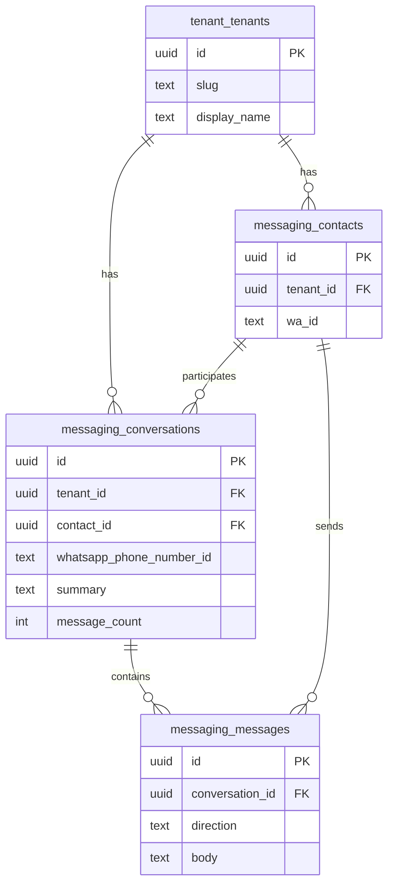

# Supabase Database — White Node / IndigoNode

PostgreSQL database hosted on Supabase for the WhatsApp automation platform. Data is organized by **schema** (namespace), not by putting everything in `public`.

**Source of truth:** SQL migrations in [`sql/`](../sql/) (run in numeric order).

---

## Migration run order

| Order | File | Purpose |
|------:|------|---------|
| 1 | `001_create_tenant_schema.sql` | `tenant` schema — tenants, profiles, WhatsApp accounts |
| 2 | `002_create_messaging_schema.sql` | `messaging` schema — contacts, conversations, messages |
| 3 | `003_create_automation_view.sql` | `tenant.v_automation_config` view |
| 4 | `004_enable_rls.sql` | Row Level Security policies |
| 5 | `005_seed_dr_luis_murillo.sql` | Seed first tenant (Dr. Luis Felipe Murillo) |
| 6 | `006_n8n_queries.sql` | **Reference only** — do not run in Supabase |
| 7 | `007_grant_api_permissions.sql` | API grants for custom schemas |
| 8 | `008_public_view_for_n8n.sql` | Optional `public.v_automation_config` proxy |
| 9 | `009_messaging_outbound_and_history.sql` | Outbound + history helpers (optional) |
| 10 | `010_conversation_summary.sql` | Rolling summary on conversations; drops `public.messages` |
| 11 | `011_fix_conversation_summary_ambiguity.sql` | Fix PL/pgSQL `contact_id` ambiguity |
| 12 | `012_conversation_message_count.sql` | `message_count` column + updated function |

---

## Architecture overview

```text
WhatsApp webhook (n8n)
        │
        ▼
tenant.v_automation_config     ← lookup tenant by whatsapp_phone_number_id
        │
        ▼
messaging.get_conversation_summary   ← contact + conversation + summary + count
        │
        ▼
AI Agent (n8n) → update_conversation_summary   ← save rolling summary
```

**Design choice (current):** Conversation **memory** is stored as a rolling `summary` on `messaging.conversations`. Individual message bodies are **not** stored in production flows (privacy + cost). The `messaging.messages` table still exists for future use or optional helpers.

**Tenant lookup key:** `whatsapp_phone_number_id` from webhook metadata — **not** the patient/customer `wa_id`.

---

## Schema: `tenant`

Business identity, configuration, and WhatsApp connection mapping.

### Tables

#### `tenant.tenants`

Core tenant (customer business) record.

| Column | Type | Notes |
|--------|------|-------|
| `id` | `uuid` PK | Default `gen_random_uuid()` |
| `slug` | `text` UNIQUE | URL-safe identifier, e.g. `dr-luis-murillo` |
| `display_name` | `text` | Human name, e.g. `Dr. Luis Felipe Murillo` |
| `business_type` | `text` | `doctor`, `lawyer`, `salon`, `restaurant`, `other` |
| `specialty` | `text` | Optional vertical label, e.g. `Neurología` |
| `is_active` | `boolean` | Default `true` |
| `created_at` | `timestamptz` | |
| `updated_at` | `timestamptz` | Auto-updated via trigger |

---

#### `tenant.business_profiles`

One row per tenant — pricing, location, flexible metadata.

| Column | Type | Notes |
|--------|------|-------|
| `tenant_id` | `uuid` PK, FK → `tenant.tenants` | |
| `service_fee` | `numeric(10,2)` | Consultation fee |
| `service_currency` | `text` | Default `BOB` |
| `address` | `text` | |
| `timezone` | `text` | Default `America/La_Paz` |
| `maps_url` | `text` | Google Maps link |
| `metadata` | `jsonb` | Flexible fields (e.g. `office_hours_start`, `office_hours_end`) |
| `updated_at` | `timestamptz` | |

---

#### `tenant.whatsapp_accounts`

Maps Meta WhatsApp Business line → tenant.

| Column | Type | Notes |
|--------|------|-------|
| `id` | `uuid` PK | |
| `tenant_id` | `uuid` FK → `tenant.tenants` | |
| `whatsapp_phone_number_id` | `text` UNIQUE | **Primary lookup key** from webhook `metadata.phone_number_id` |
| `whatsapp_business_number` | `text` | E.164 display number |
| `waba_id` | `text` | WhatsApp Business Account ID |
| `display_name` | `text` | |
| `is_primary` | `boolean` | Default `true` |
| `is_active` | `boolean` | Default `true` |
| `created_at` | `timestamptz` | |
| `updated_at` | `timestamptz` | |

**Index:** `idx_whatsapp_accounts_phone_number_id` on `whatsapp_phone_number_id` where `is_active = true`.

---

### Views

#### `tenant.v_automation_config`

Single-query tenant config for n8n. Joins `tenants` + `business_profiles` + primary active `whatsapp_accounts`.

| Output column | Source |
|---------------|--------|
| `tenant_id` | `tenants.id` |
| `slug` | `tenants.slug` |
| `tenant_name` | `tenants.display_name` |
| `business_type` | `tenants.business_type` |
| `specialty` | `tenants.specialty` |
| `tenant_active` | `tenants.is_active` |
| `service_fee`, `service_currency`, `address`, `timezone`, `maps_url` | `business_profiles` |
| `business_metadata` | `business_profiles.metadata` |
| `whatsapp_phone_number_id`, `whatsapp_business_number`, `waba_id` | `whatsapp_accounts` |

**n8n example:**

```sql
select * from tenant.v_automation_config
where whatsapp_phone_number_id = '{{ phone_number_id }}'
limit 1;
```

---

### Functions & triggers

| Object | Purpose |
|--------|---------|
| `tenant.set_updated_at()` | Trigger function — sets `updated_at = now()` |
| `trg_tenants_updated_at` | Before update on `tenant.tenants` |
| `trg_business_profiles_updated_at` | Before update on `tenant.business_profiles` |
| `trg_whatsapp_accounts_updated_at` | Before update on `tenant.whatsapp_accounts` |

---

## Schema: `messaging`

End users (contacts), conversation threads, and optional message rows.

### Entity relationship



---

### Tables

#### `messaging.contacts`

People who message a tenant (patients, customers).

| Column | Type | Notes |
|--------|------|-------|
| `id` | `uuid` PK | |
| `tenant_id` | `uuid` FK → `tenant.tenants` | |
| `wa_id` | `text` | WhatsApp ID of the **sender** (not the business line) |
| `display_name` | `text` | From webhook profile name |
| `phone_number` | `text` | Optional |
| `is_active` | `boolean` | Default `true` |
| `first_seen_at` | `timestamptz` | |
| `last_seen_at` | `timestamptz` | Updated on each message |
| `created_at` | `timestamptz` | |
| `updated_at` | `timestamptz` | |

**Unique:** `(tenant_id, wa_id)`

---

#### `messaging.conversations`

One thread per contact + tenant WhatsApp line. Holds **rolling AI summary** and **message counter**.

| Column | Type | Notes |
|--------|------|-------|
| `id` | `uuid` PK | Used by n8n to update summary |
| `tenant_id` | `uuid` FK → `tenant.tenants` | |
| `contact_id` | `uuid` FK → `messaging.contacts` | |
| `whatsapp_phone_number_id` | `text` | Business line ID |
| `status` | `text` | `open`, `closed`, `archived` — default `open` |
| `last_message_at` | `timestamptz` | |
| `summary` | `text` | Rolling AI summary (added in `010`) |
| `summary_updated_at` | `timestamptz` | Last summary write (added in `010`) |
| `message_count` | `integer` | Inbound messages processed (added in `012`); default `0` |
| `created_at` | `timestamptz` | |
| `updated_at` | `timestamptz` | |

**Unique:** `(tenant_id, contact_id, whatsapp_phone_number_id)`

**Index:** `idx_conversations_tenant_last_message` on `(tenant_id, last_message_at desc)`.

---

#### `messaging.messages`

Optional per-message storage. **Not used** in the current summary-based n8n flow, but available for future features or helpers in `009`.

| Column | Type | Notes |
|--------|------|-------|
| `id` | `uuid` PK | |
| `tenant_id` | `uuid` FK | |
| `conversation_id` | `uuid` FK | |
| `contact_id` | `uuid` FK | |
| `whatsapp_message_id` | `text` | Meta message ID (idempotency) |
| `direction` | `text` | `inbound` or `outbound` |
| `message_type` | `text` | `text`, `image`, `audio`, etc. |
| `body` | `text` | Message text |
| `status` | `text` | e.g. `received`, `sent` |
| `raw_payload` | `jsonb` | Full webhook payload |
| `sent_at` | `timestamptz` | |
| `created_at` | `timestamptz` | |

**Unique index:** `(tenant_id, whatsapp_message_id)` where `whatsapp_message_id is not null`.

---

### Functions (messaging)

#### `messaging.get_conversation_summary` — **primary n8n entry**

Called on each inbound message (Get Message Summary node).

**Parameters:**

| Parameter | Type | Description |
|-----------|------|-------------|
| `p_tenant_id` | `uuid` | From tenant config |
| `p_wa_id` | `text` | Sender WhatsApp ID |
| `p_phone_number_id` | `text` | Business line ID |
| `p_display_name` | `text` | Optional contact name |

**Returns:**

| Column | Description |
|--------|-------------|
| `contact_id` | Contact UUID (created if new) |
| `conversation_id` | Conversation UUID (created if new) |
| `summary` | Current summary or `'Sin conversación previa.'` |
| `summary_updated_at` | Last summary update timestamp |
| `message_count` | Inbound message count (+1 each call) |

**Behavior:**

1. Upsert `messaging.contacts`
2. Upsert `messaging.conversations` — sets `message_count = 1` on insert, `+ 1` on conflict
3. Returns summary + IDs for AI prompt and DB update

> **Note:** Changing the return type requires `DROP FUNCTION messaging.get_conversation_summary(uuid, text, text, text)` before `CREATE` (see `012`).

---

#### `messaging.update_conversation_summary` — **save after AI reply**

**Parameters:** `p_conversation_id uuid`, `p_summary text`

**Returns:** `timestamptz` — the new `summary_updated_at`

Updates `summary`, `summary_updated_at`, `last_message_at`, `updated_at` on `messaging.conversations`.

---

#### `messaging.record_inbound_message` — optional (full message storage)

From `002`. Resolves tenant by `whatsapp_phone_number_id`, upserts contact/conversation, inserts row in `messaging.messages`. Not used in current summary-only flow.

---

#### `messaging.record_outbound_message` — optional

From `009`. Inserts outbound message row and updates conversation timestamp.

---

#### `messaging.get_conversation_history` / `get_conversation_history_text` — optional

From `009`. Reads recent rows from `messaging.messages` for AI context. Superseded by rolling `summary` approach in production.

---

### Triggers

| Object | Purpose |
|--------|---------|
| `messaging.set_updated_at()` | Trigger function |
| `trg_contacts_updated_at` | Before update on `messaging.contacts` |
| `trg_conversations_updated_at` | Before update on `messaging.conversations` |

---

## Schema: `public`

Minimal use — legacy test table removed; optional proxy view for n8n Supabase node.

| Object | Status | Notes |
|--------|--------|-------|
| `public.messages` | **Dropped** in `010` | Was legacy test table |
| `public.v_automation_config` | Optional (`008`) | Proxy `select * from tenant.v_automation_config` for n8n REST node |

**Current n8n integration:** Postgres node (session pooler), not Supabase REST — queries `tenant` and `messaging` schemas directly.

---

## Row Level Security (RLS)

Enabled on all `tenant.*` and `messaging.*` tables (`004`).

| Role | Behavior |
|------|----------|
| `service_role` | Bypasses RLS — used by n8n Postgres connection |
| `authenticated` | `SELECT` policies on all tables (future admin UI) |
| `anon` | Schema usage grants only (`007`) |

---

## API grants

`007_grant_api_permissions.sql` grants:

- `USAGE` on schemas `tenant`, `messaging`
- `SELECT` on all tables in those schemas
- `SELECT` on `tenant.v_automation_config`

Function execution for n8n Postgres role:

- `messaging.get_conversation_summary(uuid, text, text, text)` → `postgres`, `service_role`
- `messaging.update_conversation_summary(uuid, text)` → `postgres`, `service_role`

---

## Seed data

`005_seed_dr_luis_murillo.sql` creates:

- Tenant: `dr-luis-murillo` — Dr. Luis Felipe Murillo, Neurología
- Business profile: fee, address, office hours in `metadata`
- WhatsApp account: `whatsapp_phone_number_id` must match Meta webhook

---

## Useful queries

**Tenant config:**

```sql
select * from tenant.v_automation_config
where whatsapp_phone_number_id = 'YOUR_PHONE_NUMBER_ID';
```

**Conversation state:**

```sql
select
  c.id,
  c.message_count,
  c.summary,
  c.summary_updated_at,
  ct.wa_id,
  ct.display_name
from messaging.conversations c
join messaging.contacts ct on ct.id = c.contact_id
order by c.last_message_at desc nulls last;
```

**Test summary function:**

```sql
select * from messaging.get_conversation_summary(
  'TENANT_UUID'::uuid,
  '59177944841',
  '1248499035016959',
  'Test User'
);
```

---

## Planned schemas (not yet implemented)

From project context — future domains:

| Schema | Planned contents |
|--------|------------------|
| `appointments` | Appointments, availability |
| `ai` | Agents, prompts, knowledge |
| `system` | Integrations, workflow logs, audit |

These are **not** in the current migrations.
